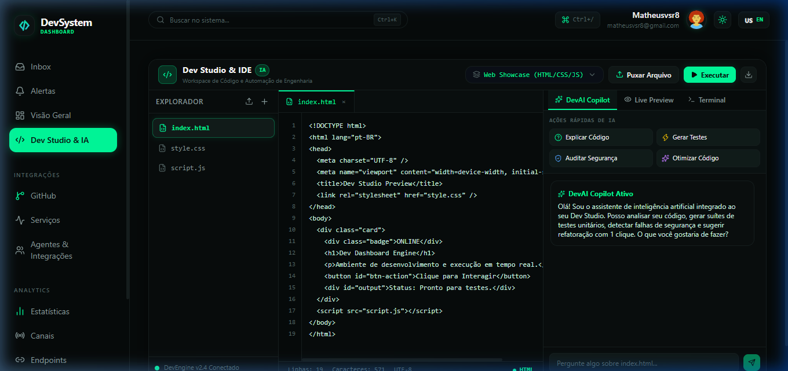
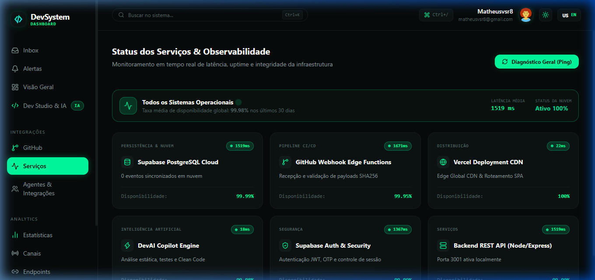

# DevSystem — Plataforma de Monitoramento & Engenharia de Software

O **DevSystem** é uma plataforma corporativa completa de observabilidade, automação e desenvolvimento em tempo real, projetada para engenheiros de software e equipes DevOps. A solução unifica o monitoramento contínuo de webhooks do GitHub, telemetria de microsserviços, geração de laudos formais de auditoria e um ambiente de desenvolvimento integrado (**Dev Studio**) com inteligência artificial nativa (**DevAI Copilot**).

<div align="center">

[](https://drive.google.com/file/d/1v_KFGhSTIIyE66by3WIpnaS9eK6LjrG2/view?usp=sharing)
[](https://painel-dev-steel.vercel.app/)

</div>

---

## Demonstração Visual da Aplicação

### Painel Principal (Visão Geral)
Métricas consolidadas em tempo real, volume de entregas diárias, distribuição por tipo de evento e rastreabilidade total de atividades por repositório.


---

### Dev Studio & Cloud IDE com DevAI
Ambiente completo de código no navegador com explorador de diretórios, abas, coloração sintática, execução interativa, sandbox e copiloto de inteligência artificial.



---

### Gestão de Webhooks do GitHub
Ponto de integração oficial com URL de webhook exclusiva por conta, garantindo que cada desenvolvedor monitore apenas os seus repositórios com **isolamento estrito de dados**.


---

### Indicadores & Métricas de Engenharia
Gráficos analíticos de distribuição de eventos, volume de commits, pull requests, deploys e colaboradores ativos com filtros de período (24h, 7d, 30d e histórico completo).


---

### Observabilidade & Health Monitor
Diagnóstico instantâneo de infraestrutura com medição de latência em milissegundos (**Ping ms**), índice de disponibilidade (**SLA 99.98%**) e monitoramento de nós serverless, banco de dados e CDN.



---

### Autenticação Segura (Login & Cadastro)
Interface moderna de autenticação com validação em tempo real de senhas e proteção de sessão de ponta a ponta.


---

## Módulos e Recursos em Destaque

### 1. Dev Studio & Cloud IDE
Ambiente de engenharia integrado diretamente ao painel, permitindo codificar, debugar e testar projetos sem sair da plataforma:
- **Templates Rápidos**: Inicialização em 1 clique de projetos *Web Showcase (HTML/CSS/JS)*, *Node.js Express API* e *Python Data Analytics*.
- **Puxar / Importar Arquivo (PC & Mobile)**: Permite importar arquivos locais diretamente do celular (Android/iOS) ou do computador (Windows/Mac/Linux), além de suportar arrastar e soltar (**Drag & Drop**) sobre o editor.
- **Edição Livre & Persistência**: Modificação em tempo real caractere por caractere, suporte a indentação inteligente (`Tab`), atalho de salvamento (`Ctrl + S`), criação e exclusão de arquivos com modais customizados.
- **Exportação do Projeto**: Download do pacote completo de arquivos para a máquina local com um clique.

---

### 2. DevAI Copilot (Inteligência Artificial Integrada)
Assistente de engenharia que atua diretamente sobre o contexto do arquivo aberto no editor:
- **Explicar Código**: Análise detalhada da arquitetura, fluxo de dados, responsabilidade do módulo e estimativa da complexidade algorítmica ($O(1)$ a $O(n)$).
- **Gerar Testes**: Criação automatizada de suítes de testes unitários com asserções reais utilizando *Vitest / Jest* (para JavaScript/TypeScript) ou *PyTest* (para Python).
- **Auditar Segurança**: Varredura estática de vulnerabilidades baseada nas diretrizes do **OWASP Top 10**, detectando riscos de injeção, XSS, sanitização de parâmetros e vazamento acidental de segredos/tokens privados.
- **Otimizar Código**: Refatoração orientada a performance e *Clean Code*, reduzindo uso de memória (*memory leaks*) com botão para **Aplicar** a sugestão da IA diretamente no editor.
- **Chat Contextual**: Diálogo livre com a IA para esclarecer dúvidas, planejar novas funções ou debugar comportamentos complexos.

---

### 3. Live Preview & Sandbox Web
Visualizador dinâmico isolado (*Sandboxed Web Runner*):
- Compila e renderiza instantaneamente o código HTML, CSS e JavaScript.
- Permite testar cliques, animações, lógica DOM e estilização visual em tempo real.
- Botão de recarregamento rápido para reiniciar o estado da página em teste.

---

### 4. Terminal Interativo de Engenharia
Console de telemetria e execução embutido na IDE:
- `run`: Compila e simula o ciclo de execução do arquivo ativo sob o motor Node.js / V8 Engine.
- `test`: Executa as suítes de testes automatizados e retorna o tempo de resposta em milissegundos.
- `ai scan`: Dispara uma auditoria de segurança completa do DevAI sobre o arquivo.
- `git status`: Exibe o estado e a quantidade de arquivos rastreados no Workspace.
- `clear` e `help`: Manutenção de histórico e exibição de comandos disponíveis.

---

### 5. Botão "Executar"
Ao clicar em **Executar**:
1. O sistema valida a integridade sintática do arquivo em edição.
2. Abre a saída no terminal interativo ou no Live Preview (para projetos web).
3. Emite parecer de execução com código de saída `[Exit code: 0]`.

---

### 6. Relatório Executivo Formal com Assinatura Técnica
Módulo voltado para governança corporativa e auditorias de software:
- Gera um laudo formal contendo volume consolidado de entregas, taxa de sucesso de CI/CD, índice de integridade de payloads (HMAC SHA-256) e parecer técnico de engenharia.
- Contém hash de autenticação exclusivo e **assinatura digital formal de Matheus Vasconcelos** (Lead Software Engineer).
- Suporte nativo à impressão em PDF (`Ctrl + P`) com layout amigável e botão para cópia rápida do laudo em texto puro.

---

### 7. Release Notes com Inteligência Artificial
- Localizado na aba GitHub Webhooks, sintetiza o histórico recente de commits, pull requests e deploys da Vercel.
- Gera um sumário executivo em Markdown pronto para ser publicado diretamente na seção de Releases do GitHub.

---

### 8. Dev CheatSheet & Atalhos de Produtividade
- Modal de referência rápida acionado via atalho global de teclado **`Ctrl + /`** ou pelo botão de atalhos no cabeçalho.
- Centraliza os atalhos essenciais:
  - `Ctrl + K`: Busca global de páginas e eventos (Spotlight).
  - `Ctrl + /`: Exibir / Ocultar o Dev CheatSheet.
  - `Esc`: Fechar buscas e janelas modais.
  - `Ctrl + Enter`: Disparar prompts no DevAI Studio.
  - `Ctrl + S`: Salvar arquivo localmente no Workspace.

---

### 9. Isolamento Estrito Multi-Tenancy (Privacidade de Dados)
- O sistema implementa uma camada de proteção em profundidade (*Double Shield* tanto no backend quanto no frontend).
- Cada perfil de usuário conectado enxerga **apenas e exclusivamente** os repositórios e eventos pertencentes à sua própria conta.
- Perfis novos iniciam com ambiente limpo, sem qualquer vazamento de dados de outros desenvolvedores.

---

## Arquitetura da Solução

```mermaid
flowchart TD
    Frontend["Interface Web & Dev Studio (React 19 / Vite 8)"]
    Backend["API de Microsserviços (Node.js / Express 5)"]
    Supabase["Banco de Dados & Autenticação (PostgreSQL Cloud)"]
    EdgeFunction["Supabase Edge Functions (Deno Serverless)"]
    GitHub["Repositórios GitHub (Webhooks em Tempo Real)"]

    Frontend <-->|Consultas REST, DevAI & Cache Local| Backend
    Backend <-->|Leitura e Persistência Segura| Supabase
    Frontend <-->|Sincronização em Tempo Real (Postgres Changes)| Supabase
    GitHub -->|Assinatura HMAC SHA-256| EdgeFunction
    EdgeFunction -->|Inserção Idempotente| Supabase
```

---

## Tecnologias Empregadas

| Camada | Tecnologia | Finalidade |
| :--- | :--- | :--- |
| **Frontend** | React 19 & Vite 8 | Interface reativa moderna com alta performance |
| **Cloud IDE & Playground** | Editor customizado com Line Numbers e Sandboxed Iframe | Edição multilinhas, abas, drag & drop e preview ao vivo |
| **Inteligência Artificial** | DevAI Copilot Engine | Geração de testes, auditoria estática e refatoração assistida |
| **Estilização** | Vanilla CSS & Tailwind CSS | Design System Dark Cyberpunk com paleta Emerald Neon (`#00ff9d`) |
| **Componentes Interativos** | CustomDropdown & AnimatePresence | Menus suspensos e modais customizados sem dependência de popups nativos |
| **Animações** | Framer Motion | Transições fluidas e micro-interações responsivas |
| **Gráficos** | Recharts | Métricas e gráficos de barras/pizza responsivos |
| **Estado & Cache** | TanStack React Query v5 | Gerenciamento e sincronização de dados assíncronos |
| **Backend** | Node.js & Express 5 | API RESTful, endpoint de IA e processamento de dados |
| **Nuvem & Auth** | Supabase (PostgreSQL & Edge Functions) | Autenticação, criptografia HMAC SHA-256 e mensageria |

---

## Guia de Instalação e Execução

### Pré-requisitos
- Node.js (versão 18 ou superior)
- Gerenciador de pacotes npm

### 1. Clonagem do Repositório
```bash
git clone https://github.com/Matheusvs1998/painel-dev.git
cd painel-dev
```

### 2. Instalação das Dependências
```bash
npm install
cd frontend && npm install
cd ../backend && npm install
cd ..
```

### 3. Configuração de Variáveis de Ambiente

Crie o arquivo `.env` no diretório `frontend/`:
```env
VITE_SUPABASE_URL=https://vdugwerpiuisyiwwkggg.supabase.co
VITE_SUPABASE_ANON_KEY=sua_chave_publica_aqui
VITE_API_BASE_URL=http://localhost:3001
```

Crie o arquivo `.env` no diretório `backend/`:
```env
SUPABASE_URL=https://vdugwerpiuisyiwwkggg.supabase.co
SUPABASE_KEY=sua_chave_publica_aqui
PORT=3001
GITHUB_WEBHOOK_SECRET=seu_segredo_opcional
```

### 4. Execução do Sistema
Para inicializar o painel e o servidor de integração simultaneamente:
```bash
npm start
```
- Interface Web: `http://localhost:5173`
- API Backend: `http://localhost:3001`

---

## Integração de Repositórios GitHub

1. No repositório desejado no GitHub, acesse **Settings** → **Webhooks** → **Add webhook**.
2. No campo **Payload URL**, insira a URL individual fornecida na aba **GitHub Webhooks** da sua conta no DevSystem.
3. Defina o **Content type** como `application/json`.
4. Selecione os eventos a serem monitorados (*Pushes, Pull requests, Releases, Issues*).
5. Confirme em **Add webhook**.

---

## Estrutura do Projeto

```text
dev-dashboard/
├── backend/                  # Servidor API Express e rotas de webhook
│   ├── .env                  # Configurações do backend
│   └── server.js             # Implementação dos serviços REST e filtros de perfil
├── frontend/                 # Aplicação cliente (SPA)
│   ├── public/               # Recursos estáticos e imagens
│   ├── src/
│   │   ├── components/       # CustomDropdown, Header, StatCard, Modais
│   │   ├── layouts/          # Estruturas de navegação e layout
│   │   ├── lib/              # Utilitários de API, Supabase e isolamento estrito
│   │   ├── pages/            # Overview, Workspace, Stats, Github, Services, Reports
│   │   └── App.jsx           # Roteamento e listeners em tempo real
│   ├── package.json          # Dependências do frontend
│   └── vercel.json           # Configuração de roteamento em produção
└── supabase/                 # Modelos de banco de dados e Edge Functions Deno
```

---

## 📱 Aplicativo Mobile (Android APK)

O **DevSystem** conta com versão nativa para dispositivos móveis Android, configurada para abrir em tela cheia com orientação travada em **modo paisagem (landscape)**, ideal para operar o painel de telemetria e o **Dev Studio**.

| Plataforma | Pacote | Link Oficial de Download |
| :--- | :--- | :--- |
| **Android (APK Nativo)** | `DevSystem.apk` | [📥 Baixar APK no Google Drive](https://drive.google.com/file/d/1v_KFGhSTIIyE66by3WIpnaS9eK6LjrG2/view?usp=sharing) |
| **Web / PWA** | `Navegador / Standalone` | [🌐 Acessar na Nuvem (Vercel)](https://painel-dev-steel.vercel.app/) |

#### Instruções de Instalação no Celular:
1. Acesse o link acima pelo navegador do seu celular Android ou baixe o arquivo **`DevSystem.apk`**.
2. Abra o arquivo baixado para iniciar a instalação.
3. Se solicitado pelo Android, autorize a instalação de aplicativos desta fonte (*Configurações > Permitir desta fonte*).
4. Abra o **DevSystem**: o aplicativo iniciará com o logotipo oficial em verde neon em tela cheia na horizontal.

---

## Autoria & Responsabilidade Técnica

Projeto planejado, arquitetado e desenvolvido por:

**Matheus Vasconcelos**  
Engenharia de Software · Arquitetura Fullstack · DevOps & Automação  
GitHub: [Matheusvs1998](https://github.com/Matheusvs1998)

---

## Licença

Este projeto é distribuído sob a licença **ISC**. Desenvolvido com foco em escalabilidade, observabilidade e boas práticas de engenharia de software.
