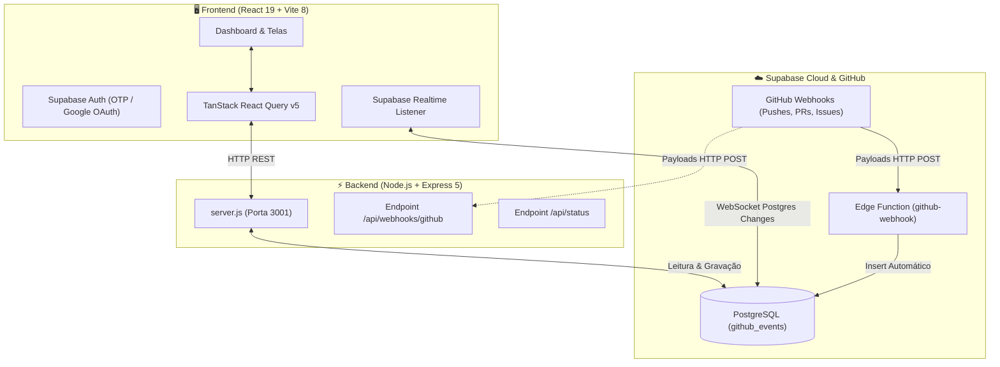

# 🚀 DevSystem — Painel de Monitoramento & Integração para Desenvolvedores

<div align="center">
  
  <h3>Dashboard Fullstack em Tempo Real para Monitoramento de Engenharia e Webhooks</h3>

  
  
  
  
  
</div>

---

## 📖 Sobre o Projeto

O **DevSystem** é uma plataforma fullstack moderna desenvolvida para engenheiros de software, equipes de desenvolvimento e DevOps acompanharem em tempo real o fluxo de atividades de repositórios do GitHub, integridade de microserviços, métricas de SLA e despacho de notificações para múltiplos canais.

Construído com **React 19**, **Vite 8**, **Tailwind CSS**, **Node.js/Express 5** e banco de dados **Supabase PostgreSQL**, o sistema conta com design Dark Mode Neon de alto padrão, animações fluidas via **Framer Motion**, gráficos interativos com **Recharts** e sincronização instantânea via **Supabase Realtime**.

---

## 🏛️ Arquitetura do Sistema



---

## ✨ Funcionalidades Principais

### 1. 📊 Visão Geral Dinâmica (`Overview`)
- Métricas em tempo real de eventos recebidos, repositórios ativos e latência do backend.
- Gráfico de área em degradê neon mostrando o volume de eventos por dia da semana.
- Gráfico em anel com a distribuição proporcional dos tipos de eventos (*Push, Pull Request, Issues, Stars*).
- Tabela ao vivo com os últimos eventos capturados.

### 2. 🐙 Ingestão de Webhooks do GitHub (`GitHub`)
- Monitoramento de eventos com identificação de autor, repositório, tipo de ação e timestamp.
- Caixa com URL oficial da Edge Function do Supabase e botão de cópia rápida.

### 3. 📬 Inbox Centralizada (`Inbox`)
- Notificações de eventos e avisos do sistema com filtros rápidos (*Todas, Não lidas, GitHub, Sistema*).
- Campo de busca instantânea e botão para marcar como lida individualmente ou em lote.

### 4. 🚨 Monitoramento de Alertas & Incidentes (`Alerts`)
- Monitor de saúde de infraestrutura com categorização por severidade (*Crítico, Aviso, Info, Resolvido*).
- Medição de uptime geral (99.98%) e ação de resolução de alertas.

### 5. 📈 Estatísticas & Métricas de Engenharia (`Stats`)
- Gráficos de barra com os top repositórios por volume e colaboradores mais ativos.
- Análise de eficiência e taxa de sucesso de ingestão (100%).

### 6. 📡 Canais de Notificação (`Channels`)
- Gestão de conexões para **Discord**, **Slack**, **Telegram**, **E-mail (SMTP)** e **Custom Webhooks**.
- Botão interativo para disparo de testes simulados de envio de mensagens com feedback visual via Toast.

### 7. 📑 Relatórios & Exportação de Dados (`Reports`)
- Pré-visualização dos registros salvos no banco.
- **Exportação com 1 clique para CSV** (compatível com Excel e PowerBI) e **JSON estruturado**.

### 8. ⚡ Status dos Serviços & Endpoints (`Services` e `Endpoints`)
- Verificação de saúde em tempo real da API Express, Supabase Database, Runtime Node.js e Edge Functions.
- Catálogo documentado dos endpoints da API REST.

### 9. 🔐 Autenticação com Token OTP e Google OAuth (`Auth`)
- Cadastro e login seguros via **Supabase Auth**.
- Suporte a **Token OTP de 6 dígitos** enviado por e-mail com tela dedicada e reenvio.
- Botão oficial de **Login com a Google**.

---

## 🛠️ Tecnologias Utilizadas

### Frontend
- **React 19** (`^19.2.8`) & **React DOM 19**
- **Vite 8** (`^8.2.0`) — Build tool ultra veloz
- **Tailwind CSS v4** & PostCSS — Estilização moderna
- **Framer Motion** (`^13.1.1`) — Animações e micro-interações
- **TanStack React Query v5** (`^5.102.2`) — Gerenciamento de estado assíncrono e cache
- **Recharts** (`^3.10.1`) — Gráficos vetoriais responsivos
- **Lucide React** — Ícones minimalistas
- **Sonner** — Notificações Toast ricas e sonoras
- **i18next & react-i18next** — Suporte a múltiplos idiomas (PT-BR / EN-US)

### Backend
- **Node.js** & **Express 5** (`^5.2.1`)
- **@supabase/supabase-js** (`^2.112.1`)
- **Cors** & **Dotenv**
- **Crypto** — Validação de assinaturas HMAC-SHA256 do GitHub

### Banco de Dados & Nuvem
- **Supabase** (PostgreSQL com Row Level Security)
- **Supabase Realtime** (WebSocket Database Changes)
- **Supabase Edge Functions** (Deno Runtime)

---

## 📦 Como Instalar e Rodar o Projeto

### Pré-requisitos
- **Node.js** (versão 18 ou superior)
- Gerenciador de pacotes **npm** ou **yarn**

### 1. Clonar o Repositório
```bash
git clone https://github.com/Matheusvs1998/painel-dev.git
cd painel-dev
```

### 2. Instalar Dependências
```bash
# Na raiz do projeto:
npm install

# Instalar dependências do frontend e backend:
cd frontend && npm install
cd ../backend && npm install
cd ..
```

### 3. Configurar as Variáveis de Ambiente

Crie o arquivo `.env` dentro da pasta `frontend/`:
```env
VITE_SUPABASE_URL=https://seu-projeto.supabase.co
VITE_SUPABASE_ANON_KEY=sua-chave-anon-aqui
VITE_API_BASE_URL=http://localhost:3001
```

Crie o arquivo `.env` dentro da pasta `backend/`:
```env
SUPABASE_URL=https://seu-projeto.supabase.co
SUPABASE_KEY=sua-chave-anon-aqui
PORT=3001
GITHUB_WEBHOOK_SECRET=opcional_seu_segredo_aqui
```

### 4. Executar a Aplicação
Para rodar o **Frontend** e o **Backend** juntos com um único comando:
```bash
# Na raiz do projeto:
npm start
```
- **Frontend**: `http://localhost:5173`
- **Backend API**: `http://localhost:3001`

---

## 🗄️ Configuração do Banco de Dados (Supabase)

No painel do seu projeto no **Supabase**, acesse o **SQL Editor** e execute o script para criar a tabela de eventos:

```sql
-- Criação da tabela de eventos do GitHub
CREATE TABLE IF NOT EXISTS public.github_events (
    id BIGSERIAL PRIMARY KEY,
    event_type TEXT NOT NULL,
    action TEXT,
    sender TEXT,
    repo TEXT,
    created_at TIMESTAMP WITH TIME ZONE DEFAULT timezone('utc'::text, now()) NOT NULL
);

-- Ativação de Row Level Security (RLS)
ALTER TABLE public.github_events ENABLE ROW LEVEL SECURITY;

-- Políticas de Leitura e Inserção Públicas
CREATE POLICY "Allow public select on github_events"
ON public.github_events FOR SELECT TO public USING (true);

CREATE POLICY "Allow public insert on github_events"
ON public.github_events FOR INSERT TO public WITH CHECK (true);
```

---

## 🐙 Como Conectar um Repositório GitHub ao Painel

1. Abra o repositório desejado no GitHub.
2. Vá em **Settings** > **Webhooks** > **Add webhook**.
3. Preencha os dados:
   - **Payload URL**:
     ```text
     https://vdugwerpiuisyiwwkggg.supabase.co/functions/v1/github-webhook
     ```
   - **Content type**: `application/json` *(Obrigatório)*
   - **Secret**: Deixe em branco (ou use o mesmo valor configurado nas secrets do Supabase).
   - **Events**: Marque **"Send me everything"** (ou escolha *Pushes*, *Pull requests*, *Issues*, *Stars*).
4. Clique em **Add webhook**.

> 🎉 **Pronto!** A partir de agora, qualquer alteração, push ou commit no seu repositório será registrado e exibido instantaneamente no Dashboard via Realtime.

---

## 📂 Estrutura de Pastas

```text
dev-dashboard/
├── backend/
│   ├── .env                    # Variáveis de ambiente do backend
│   ├── package.json            # Dependências da API Express
│   └── server.js               # Servidor REST e rotas de webhooks
├── frontend/
│   ├── .env                    # Variáveis de ambiente do Vite
│   ├── index.html              # HTML base com meta tags e favicon SVG
│   ├── package.json            # Dependências do React 19
│   ├── public/
│   │   └── favicon.svg         # Logotipo vetorial do DevSystem
│   └── src/
│       ├── components/         # Logo, Sidebar, Header, Auth, StatCard, etc.
│       ├── layouts/            # Layout principal (AppLayout)
│       ├── lib/                # Configuração do Supabase e cliente de API (api.js)
│       ├── pages/              # Overview, Github, Services, Contacts, Endpoints,
│       │                       # Stats, Channels, Reports, Inbox, Alerts
│       ├── App.jsx             # Roteamento e listeners do Supabase Realtime
│       ├── i18n.js             # Internacionalização (PT-BR / EN-US)
│       └── main.jsx            # Ponto de entrada do React
└── supabase/
    ├── email-templates/        # Templates HTML profissionais de e-mails/tokens
    └── functions/
        └── github-webhook/     # Edge Function em Deno para ingestão de webhooks
```

---

## 📄 Licença

Este projeto está sob a licença **ISC**. Desenvolvido para fins de monitoramento, automação e gestão de engenharia de software.
