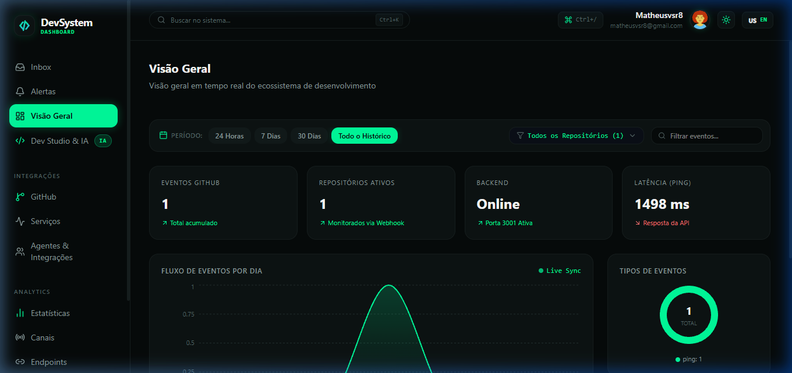
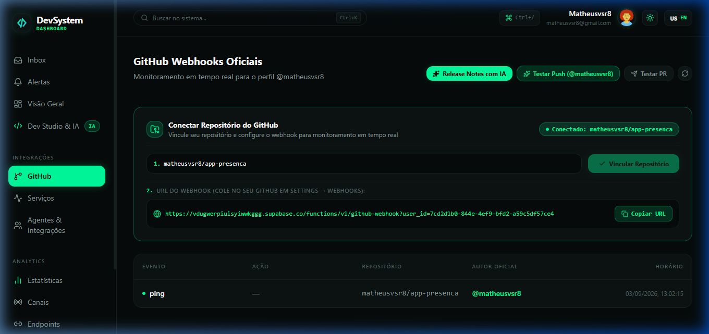
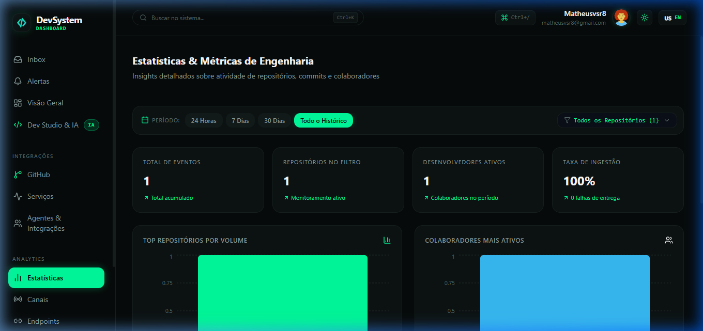
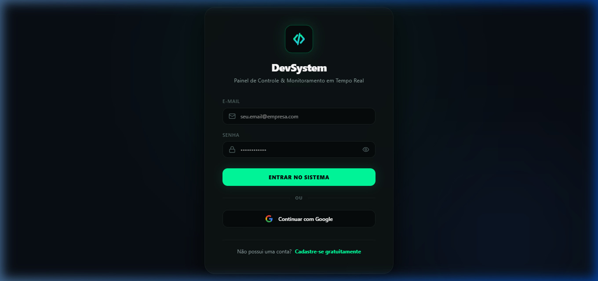
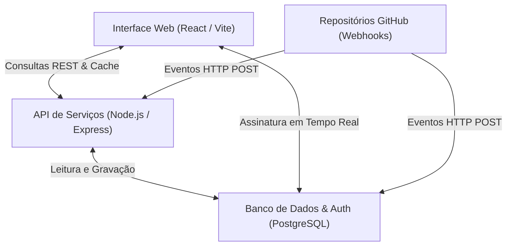

# DevSystem — Plataforma de Monitoramento & Integração para Engenharia

O **DevSystem** é uma plataforma corporativa em tempo real desenvolvida para equipes de engenharia de software e operações (DevOps). A solução centraliza o monitoramento de atividades em repositórios do GitHub, acompanha a saúde operacional de serviços e automatiza o fluxo de notificações com suporte nativo a múltiplos usuários e isolamento de dados.

---

## Demonstração Visual da Aplicação

### Painel Principal (Visão Geral)
Métricas em tempo real, volume de entregas diárias, distribuição por tipo de evento e listagem consolidada de atividades.



---

### Gestão de Webhooks do GitHub
Ponto de integração com URL de webhook exclusiva por conta, permitindo que cada usuário monitore seus repositórios de forma isolada.



---

### Indicadores & Métricas de Engenharia
Gráficos de barras comparativos por repositório e colaborador, tempo médio de processamento e taxa de entrega operacional.



---

### Autenticação & Controle de Acesso
Acesso seguro com suporte a credenciais criptografadas, validação de senhas, verificação em duas etapas via código numérico (OTP) e login social via Google.



---

## Principais Recursos

- **Monitoramento em Tempo Real**: Conexão contínua via WebSocket para exibição instantânea de pushes, pull requests, issues e lançamentos.
- **Ambiente Multi-Tenancy**: Isolamento completo de dados por perfil. Cada desenvolvedor gerencia exclusivamente seus repositórios e eventos.
- **Filtros Analíticos**: Segmentação de indicadores por períodos (24 horas, 7 dias, 30 dias ou histórico completo) e por repositório.
- **Localizador Global (Spotlight)**: Mecanismo de busca rápida (acessível via `Ctrl + K`) para transição ágil entre módulos e filtragem de eventos.
- **Central de Relatórios**: Exportação de dados oficiais em formatos estruturados CSV e JSON para auditoria e relatórios gerenciais.
- **Notificações Flexíveis**: Estrutura preparada para despacho de alertas em múltiplos canais (Discord, Slack, Telegram e E-mail).

---

## Arquitetura da Solução



---

## Tecnologias Empregadas

| Camada | Tecnologia | Finalidade |
| :--- | :--- | :--- |
| **Frontend** | React 19 & Vite 8 | Construção de interface reativa de alta performance |
| **Estilização** | Tailwind CSS v4 & Vanilla CSS | Sistema de design e padronização visual |
| **Animações** | Framer Motion | Transições suaves e micro-interações de usuário |
| **Gráficos** | Recharts | Visualização analítica responsiva |
| **Estado & Cache** | TanStack React Query v5 | Gerenciamento e sincronização de dados assíncronos |
| **Backend** | Node.js & Express 5 | API RESTful e processamento de webhooks |
| **Banco de Dados** | Supabase (PostgreSQL) | Persistência relacional, autenticação e mensageria |

---

## Guia de Instalação e Execução

### Pré-requisitos
- Node.js (versão 18 ou superior)
- Gerenciador de pacotes npm

### 1. Clonagem do Repositório
```bash
git clone https://github.com/Matheusvs1998/painel-dev.git
cd painel-dev
```

### 2. Instalação das Dependências
```bash
npm install
cd frontend && npm install
cd ../backend && npm install
cd ..
```

### 3. Configuração de Variáveis de Ambiente

Crie o arquivo `.env` no diretório `frontend/`:
```env
VITE_SUPABASE_URL=https://vdugwerpiuisyiwwkggg.supabase.co
VITE_SUPABASE_ANON_KEY=sua_chave_publica_aqui
VITE_API_BASE_URL=http://localhost:3001
```

Crie o arquivo `.env` no diretório `backend/`:
```env
SUPABASE_URL=https://vdugwerpiuisyiwwkggg.supabase.co
SUPABASE_KEY=sua_chave_publica_aqui
PORT=3001
GITHUB_WEBHOOK_SECRET=seu_segredo_opcional
```

### 4. Execução do Sistema
Para inicializar o painel e o servidor de integração simultaneamente:
```bash
npm start
```
- Interface Web: `http://localhost:5173`
- API Backend: `http://localhost:3001`

---

## Integração de Repositórios GitHub

1. No repositório desejado no GitHub, acesse **Settings** → **Webhooks** → **Add webhook**.
2. No campo **Payload URL**, insira a URL individual fornecida na aba **GitHub Webhooks** da sua conta no DevSystem.
3. Defina o **Content type** como `application/json`.
4. Selecione os eventos a serem monitorados (*Pushes, Pull requests, Issues, Stars*).
5. Confirme em **Add webhook**.

---

## Estrutura do Projeto

```text
dev-dashboard/
├── backend/                  # Servidor API Express e rotas de webhook
│   ├── .env                  # Configurações do backend
│   └── server.js             # Implementação dos serviços REST
├── docs/
│   └── screenshots/          # Imagens de demonstração
├── frontend/                 # Aplicação cliente (SPA)
│   ├── public/               # Recursos estáticos e imagens
│   ├── src/
│   │   ├── components/       # Componentes modulares e reutilizáveis
│   │   ├── layouts/          # Estruturas de navegação e layout
│   │   ├── lib/              # Utilitários de API e Supabase
│   │   ├── pages/            # Módulos e páginas do sistema
│   │   └── App.jsx           # Roteamento e listeners em tempo real
│   ├── package.json          # Dependências do frontend
│   └── vercel.json           # Configuração de roteamento em produção
└── supabase/                 # Modelos de banco de dados e funções serverless
```

---

## Autoria & Responsabilidade Técnica

Projeto planejado, arquitetado e desenvolvido por:

**Matheus Vasconcelos**  
Engenharia de Software · Arquitetura Fullstack · DevOps & Automação  
GitHub: [Matheusvs1998](https://github.com/Matheusvs1998)

---

## Licença

Este projeto é distribuído sob a licença **ISC**. Desenvolvido com foco em escalabilidade, observabilidade e boas práticas de engenharia de software.
