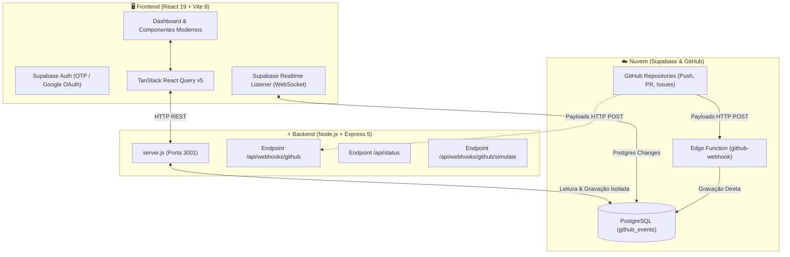

# 🚀 DevSystem — Painel de Monitoramento & Integração para Desenvolvedores

<div align="center">
  
  <h2>Plataforma Fullstack em Tempo Real para Monitoramento de Engenharia e Webhooks</h2>

  
  
  
  
  
  
</div>

---

## 📖 Visão Geral do Projeto

O **DevSystem** é uma plataforma moderna desenvolvida para engenheiros de software, equipes de desenvolvimento e operações (DevOps) acompanharem em tempo real o fluxo de atividades de repositórios do **GitHub**, a integridade de microserviços, métricas analíticas de entrega e o despacho de notificações com **isolamento estrito de dados por perfil de usuário (Multi-Tenancy)**.

Construído com as versões mais recentes das tecnologias de mercado (**React 19**, **Vite 8**, **Tailwind CSS**, **Node.js/Express 5** e banco de dados **Supabase PostgreSQL**), o sistema oferece uma experiência visual de alto nível com design **Dark Mode Neon Esmeralda (`#00ff9d`)**, animações fluidas via **Framer Motion**, gráficos interativos via **Recharts** e sincronização instantânea via **Supabase Realtime**.

---

## 📸 Demonstração Visual da Aplicação

### 1. 📊 Visão Geral & Métricas em Tempo Real (`Overview`)
Painel analítico central com cartões de indicadores (KPIs), gráfico de fluxo de eventos por dia da semana, distribuição proporcional por tipo de evento e tabela de eventos oficiais filtrados.


---

### 2. 🐙 Ingestão de Webhooks do GitHub com Isolamento por Perfil (`GitHub`)
Central de controle de webhooks onde cada autor possui a sua **URL de webhook exclusiva**. Conta com botões para testes de disparo ao vivo e tabela de eventos recebidos em tempo real.


---

### 3. 📈 Estatísticas & Métricas de Engenharia (`Stats`)
Gráficos de barras interativos com o ranking dos repositórios mais movimentados, colaboradores mais ativos, eficiência média de ingestão (~18ms) e taxa de sucesso de 100%.


---

### 4. 🔐 Autenticação com Validação de Senha & Token OTP (`Auth`)
Tela de login e cadastro com efeito *Glassmorphism*, validação em tempo real de senhas idênticas, suporte a **Token OTP de 6 dígitos** enviado por e-mail e botão oficial de **Login com a Google (OAuth)**.


---

## 🏛️ Arquitetura do Sistema



---

## ✨ Funcionalidades em Destaque

- **🎬 Tela de Abertura Futurista (`SplashScreen`)**: Animação de inicialização suave com o logotipo oficial estilizado em verde neon antes do carregamento do dashboard.
- **🔒 Isolamento Rigoroso de Dados por Perfil (Multi-Tenancy)**: Cada conta registrada possui seus próprios dados, seus próprios eventos e uma **URL de Webhook oficial exclusiva** (`?user_id=...`).
- **📅 Filtros de Período & Repositórios**: Filtre qualquer gráfico ou tabela por `24 Horas`, `7 Dias`, `30 Dias` ou `Todo o Histórico`, além de filtrar por repositório específico.
- **🔍 Busca Global Inteligente (`Spotlight / Ctrl+K`)**: Barra de pesquisa universal no cabeçalho para navegar instantaneamente entre telas e localizar eventos por repositório ou autor.
- **👤 Perfil & Preferências Personalizadas**: Modal com abas para edição de nome, foto de perfil com gerador de avatar DiceBear, alternância de tema visual e idioma.
- **📡 Central de Canais de Notificação**: Gestão e simulação de envio para Discord, Slack, Telegram, E-mail e Webhooks customizados.
- **📑 Exportação de Relatórios**: Download com 1 clique de dados oficiais nos formatos **CSV** (compatível com Excel) e **JSON estruturado**.

---

## 🛠️ Tecnologias Utilizadas

### Frontend
- **React 19** (`^19.2.8`) & **React DOM 19**
- **Vite 8** (`^8.2.0`) — Build tool de alta performance
- **Tailwind CSS v4** — Estilização utilitária e design tokens
- **Framer Motion** (`^13.1.1`) — Animações fluidas e micro-interações
- **TanStack React Query v5** (`^5.102.2`) — Gerenciamento de cache e sincronização de dados
- **Recharts** (`^3.10.1`) — Visualização gráfica responsiva (Área, Barras, Pizza)
- **Lucide React** — Pacote completo de ícones modernos
- **Sonner** — Notificações Toast elegantes
- **i18next** — Internacionalização completa (Português PT-BR e Inglês EN-US)

### Backend
- **Node.js** & **Express 5** (`^5.2.1`)
- **@supabase/supabase-js** (`^2.112.1`)
- **Cors** & **Dotenv**
- **Crypto** — Validação criptográfica de assinaturas HMAC-SHA256

### Banco de Dados & Infraestrutura
- **Supabase** (PostgreSQL com Row Level Security)
- **Supabase Realtime** (WebSocket Database Changes)
- **Supabase Edge Functions** (Deno Runtime)

---

## 📦 Como Instalar e Rodar o Projeto Localmente

### Pré-requisitos
- **Node.js** (v18 ou superior)
- Gerenciador **npm** ou **yarn**

### 1. Clonar o Repositório
```bash
git clone https://github.com/Matheusvs1998/painel-dev.git
cd painel-dev
```

### 2. Instalar as Dependências
```bash
# Na raiz do projeto:
npm install

# Instalar dependências das pastas frontend e backend:
cd frontend && npm install
cd ../backend && npm install
cd ..
```

### 3. Configurar as Variáveis de Ambiente

Crie o arquivo `.env` dentro da pasta `frontend/`:
```env
VITE_SUPABASE_URL=https://vdugwerpiuisyiwwkggg.supabase.co
VITE_SUPABASE_ANON_KEY=sua-chave-anon-aqui
VITE_API_BASE_URL=http://localhost:3001
```

Crie o arquivo `.env` dentro da pasta `backend/`:
```env
SUPABASE_URL=https://vdugwerpiuisyiwwkggg.supabase.co
SUPABASE_KEY=sua-chave-anon-aqui
PORT=3001
GITHUB_WEBHOOK_SECRET=opcional_seu_segredo
```

### 4. Inicializar a Aplicação
Para rodar o **Frontend** e o **Backend** simultaneamente:
```bash
# Na raiz do projeto:
npm start
```
- **Aplicação Web (Frontend)**: `http://localhost:5173`
- **API REST (Backend)**: `http://localhost:3001`

---

## 🐙 Como Conectar um Repositório GitHub

1. Acesse o seu repositório no GitHub.
2. Vá em **Settings** → **Webhooks** → **Add webhook**.
3. No campo **Payload URL**, cole a URL exclusiva que aparece na sua tela do DevSystem:
   ```text
   https://vdugwerpiuisyiwwkggg.supabase.co/functions/v1/github-webhook?user_id=SEU_ID_DE_USUARIO
   ```
4. Em **Content type**, selecione: `application/json` *(obrigatório)*.
5. Em **Which events would you like to trigger this webhook?**, selecione: **Send me everything** (ou escolha *Pushes*, *Pull requests*, *Issues*, *Stars*).
6. Clique em **Add webhook**.

A partir deste momento, qualquer push, commit ou pull request no seu repositório aparecerá instantaneamente no seu painel!

---

## 📂 Estrutura de Pastas do Projeto

```text
dev-dashboard/
├── backend/
│   ├── .env                    # Configurações do servidor backend
│   ├── package.json            # Dependências da API Express
│   └── server.js               # API REST, endpoints de webhooks e status
├── docs/
│   └── screenshots/            # Capturas de tela para documentação
├── frontend/
│   ├── public/
│   │   ├── favicon.svg         # Ícone vetorial da marca DevSystem
│   │   └── screenshots/        # Capturas de tela integradas ao frontend
│   ├── src/
│   │   ├── components/         # Logo, Header, Sidebar, Auth, SplashScreen, ProfileModal
│   │   ├── layouts/            # AppLayout (Sidebar + Header + Outlet)
│   │   ├── lib/                # Configuração do Supabase e api.js
│   │   ├── pages/              # Overview, Github, Stats, Inbox, Alerts, Channels, Reports, Services, Endpoints
│   │   ├── App.jsx             # Roteador principal e listeners de Realtime
│   │   ├── i18n.js             # Internacionalização PT-BR / EN-US
│   │   └── main.jsx            # Ponto de entrada do React 19
│   ├── package.json            # Dependências do frontend
│   └── vite.config.js          # Configuração do Vite 8
└── supabase/
    ├── email-templates/        # Templates HTML profissionais em verde neon
    └── functions/
        └── github-webhook/     # Edge Function em Deno para ingestão de eventos
```

---

## 👤 Autoria & Créditos

<div align="center">
  <p>Projeto concebido, planejado e desenvolvido por:</p>
  <h3>👨‍💻 <strong>Matheus Vasconcelos</strong></h3>
  <p>Engenharia de Software · Arquitetura Fullstack · DevOps & Automações</p>
  
  [](https://github.com/Matheusvs1998)
</div>

---

## 📄 Licença

Este projeto está sob a licença **ISC**. Desenvolvido para fins de monitoramento, automação e gestão de engenharia de software de alta performance.
